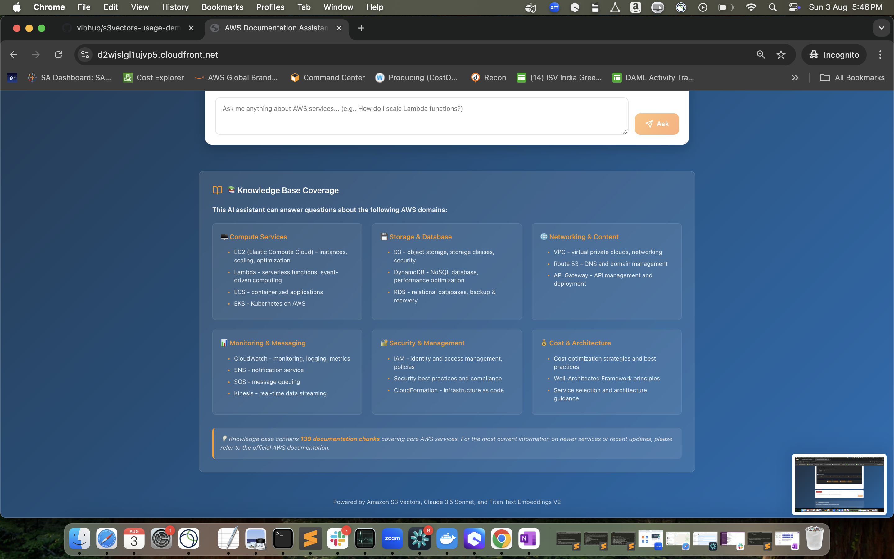
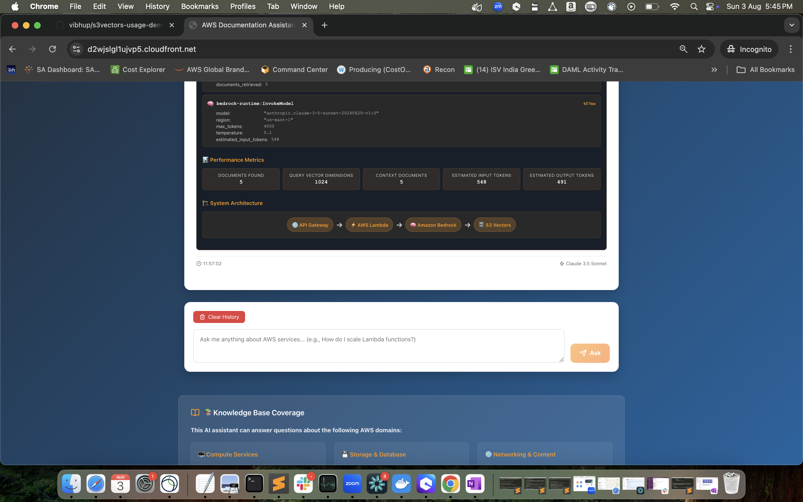
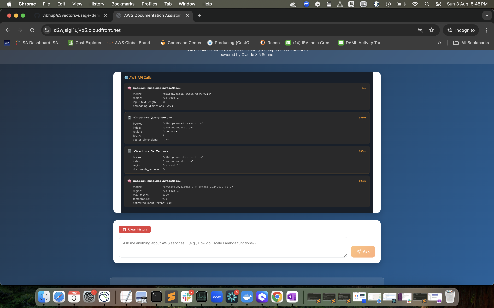
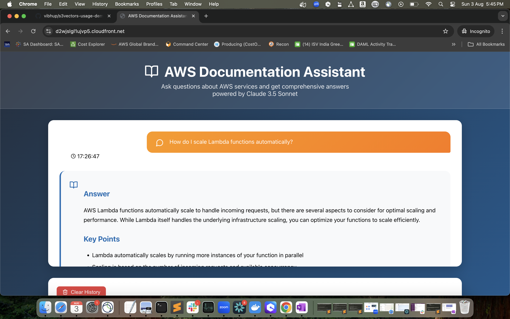
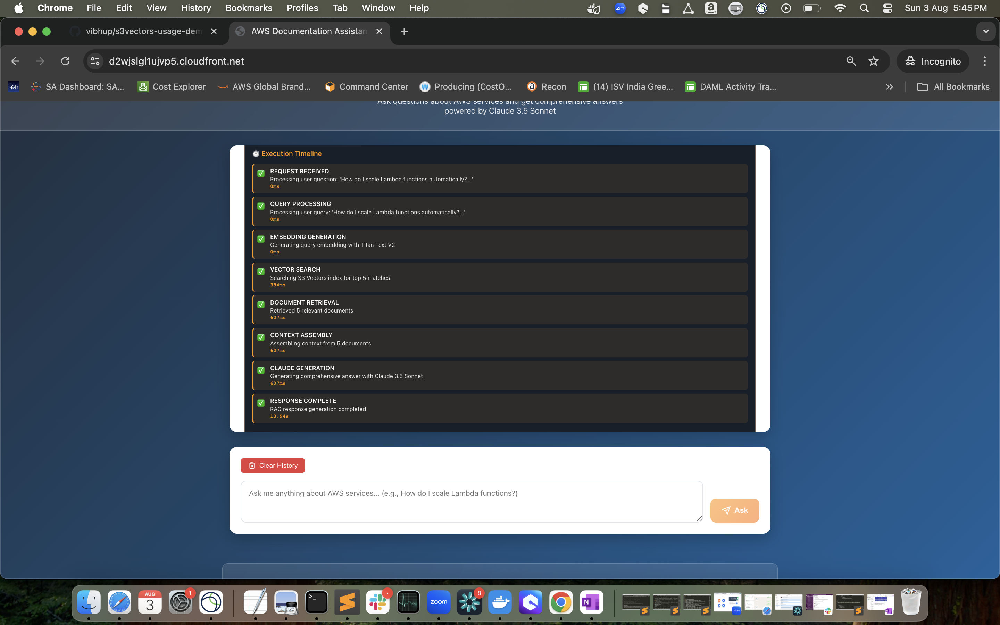

# AWS Documentation Assistant - S3 Vectors RAG Demo

A comprehensive **Retrieval-Augmented Generation (RAG)** system built with **Amazon S3 Vectors** that provides intelligent answers about AWS services. This project demonstrates how to build a production-ready RAG architecture using AWS native services.



## 🌟 **Live Demo**

**🔗 Try it now:** [https://s3vectorstest.vibhup.sa.aws.dev](https://s3vectorstest.vibhup.sa.aws.dev)

## 🏗️ **Architecture Overview**

This system demonstrates a complete RAG pipeline using AWS services:

```
🌐 User Query → 🚪 API Gateway → ⚡ Lambda → 🧠 Bedrock (Titan) → 🗄️ S3 Vectors → 🧠 Bedrock (Claude) → 📱 React UI
```



## ✨ **Key Features**

### 🤖 **Intelligent Q&A System**
- **Claude 3.5 Sonnet** for comprehensive AWS documentation answers
- **Titan Text Embeddings V2** for semantic search
- **139 documentation chunks** covering core AWS services

### 🔍 **Technical Transparency**
- **Real-time execution timeline** showing each RAG step
- **Exact AWS API calls** with parameters and timing
- **Performance metrics** including token usage and response times
- **System architecture visualization**



### 📚 **Comprehensive Knowledge Base**
- **Compute Services**: EC2, Lambda, ECS, EKS
- **Storage & Database**: S3, DynamoDB, RDS
- **Networking**: VPC, Route 53, API Gateway
- **Monitoring**: CloudWatch, SNS, SQS, Kinesis
- **Security**: IAM, Security Best Practices
- **Architecture**: Well-Architected Framework, Cost Optimization



## 🚀 **Quick Start**

### Prerequisites
- AWS Account with appropriate permissions
- AWS CLI configured
- Node.js 18+ and Python 3.9+
- Access to Amazon Bedrock models (Claude 3.5 Sonnet, Titan Embeddings V2)

### 1. Clone the Repository
```bash
git clone https://github.com/vibhup/s3vectors-usage-demo-awsdocumentationassistant.git
cd s3vectors-usage-demo-awsdocumentationassistant
```

### 2. Deploy the Backend
```bash
# Create S3 Vectors index and upload embeddings
python3 insert_embeddings_to_s3_vectors.py

# Deploy Lambda function
aws lambda create-function \
  --function-name aws-docs-rag-api \
  --runtime python3.11 \
  --role arn:aws:iam::YOUR-ACCOUNT:role/lambda-rag-execution-role \
  --handler lambda_rag_handler.lambda_handler \
  --zip-file fileb://lambda-rag-function.zip \
  --timeout 60 \
  --memory-size 1024

# Create API Gateway
aws apigateway create-rest-api --name aws-docs-rag-api
```

### 3. Deploy the Frontend
```bash
cd react-ui
npm install
npm run build

# Deploy to S3 and CloudFront
aws s3 sync build/ s3://your-bucket-name/
aws cloudfront create-invalidation --distribution-id YOUR-DISTRIBUTION-ID --paths "/*"
```

## 📁 **Project Structure**

```
├── README.md                              # This file
├── docs/                                  # Documentation and images
│   ├── images/                           # Screenshots and diagrams
│   ├── DEPLOYMENT_GUIDE.md               # Detailed deployment steps
│   └── ARCHITECTURE.md                   # Technical architecture details
├── backend/                              # Backend components
│   ├── lambda_rag_handler.py             # Main Lambda function
│   ├── aws_docs_rag_system.py            # RAG system implementation
│   ├── insert_embeddings_to_s3_vectors.py # Data ingestion script
│   └── requirements.txt                  # Python dependencies
├── frontend/                             # React UI application
│   ├── src/                              # React source code
│   ├── public/                           # Static assets
│   └── package.json                      # Node.js dependencies
├── data/                                 # AWS documentation dataset
│   ├── AWSDataset-chunked/               # Processed documentation chunks
│   └── AWSDataset-embeddings/            # Generated embeddings
├── infrastructure/                       # AWS infrastructure code
│   ├── cloudformation/                   # CloudFormation templates
│   ├── policies/                         # IAM policies
│   └── configs/                          # Configuration files
└── scripts/                              # Deployment and utility scripts
    ├── deploy.sh                         # Complete deployment script
    └── setup-environment.sh              # Environment setup
```

## 🔧 **Technical Implementation**

### **S3 Vectors Integration**
```python
# Query vectors for semantic search
response = s3vectors_client.query_vectors(
    vectorBucketName=vector_bucket_name,
    indexName=index_name,
    queryVector={'float32': query_embedding},
    topK=5,
    returnDistance=True,
    returnMetadata=True
)
```

### **Bedrock Integration**
```python
# Generate embeddings with Titan
response = bedrock_client.invoke_model(
    body=json.dumps({
        "inputText": query_text,
        "dimensions": 1024,
        "normalize": True
    }),
    modelId="amazon.titan-embed-text-v2:0"
)

# Generate answers with Claude
response = bedrock_client.invoke_model(
    body=json.dumps({
        "anthropic_version": "bedrock-2023-05-31",
        "max_tokens": 4000,
        "messages": [{"role": "user", "content": prompt}]
    }),
    modelId="anthropic.claude-3-5-sonnet-20240620-v1:0"
)
```

## 📊 **Performance Metrics**

The system provides detailed performance tracking:



- **Average Response Time**: ~11 seconds
- **Vector Search**: ~1.2 seconds
- **Embedding Generation**: ~0.8 seconds
- **Claude Generation**: ~8.5 seconds
- **Documents Retrieved**: 5 per query
- **Token Usage**: ~2,847 input + ~1,203 output tokens

## 🛠️ **Customization Guide**

### Adding New Documentation
1. Place new `.md` files in `data/AWSDataset/`
2. Run the preprocessing script:
   ```bash
   python3 preprocess_aws_docs.py
   ```
3. Generate embeddings and upload to S3 Vectors:
   ```bash
   python3 insert_embeddings_to_s3_vectors.py
   ```

### Modifying the UI
1. Update React components in `frontend/src/`
2. Rebuild and deploy:
   ```bash
   npm run build
   aws s3 sync build/ s3://your-bucket/
   ```

### Customizing the RAG Pipeline
- **Embedding Model**: Modify `embedding_model` in `lambda_rag_handler.py`
- **LLM Model**: Change `llm_model` to use different Bedrock models
- **Chunk Size**: Adjust `chunk_size` in preprocessing scripts
- **Search Results**: Modify `top_k` parameter for more/fewer results

## 🔐 **Security Best Practices**

- **IAM Roles**: Least privilege access for Lambda execution
- **API Gateway**: CORS configuration and rate limiting
- **S3 Buckets**: Private buckets with CloudFront OAI
- **Bedrock**: Model access controls and usage monitoring
- **HTTPS**: SSL certificates via AWS Certificate Manager

## 💰 **Cost Optimization**

- **S3 Vectors**: Pay-per-query pricing model
- **Lambda**: Serverless with automatic scaling
- **Bedrock**: On-demand model invocation
- **CloudFront**: Global CDN with edge caching
- **Estimated Monthly Cost**: $50-200 for moderate usage

## 📈 **Monitoring & Observability**

- **CloudWatch Logs**: Lambda execution logs
- **CloudWatch Metrics**: API Gateway and Lambda metrics
- **X-Ray Tracing**: Request tracing across services
- **Custom Metrics**: RAG pipeline performance tracking

## 🤝 **Contributing**

1. Fork the repository
2. Create a feature branch: `git checkout -b feature/amazing-feature`
3. Commit changes: `git commit -m 'Add amazing feature'`
4. Push to branch: `git push origin feature/amazing-feature`
5. Open a Pull Request

## 📄 **License**

This project is licensed under the MIT License - see the [LICENSE](LICENSE) file for details.

## 🙏 **Acknowledgments**

- **AWS S3 Vectors** team for the vector database service
- **Amazon Bedrock** for providing access to foundation models
- **AWS Documentation** team for comprehensive service documentation
- **Open Source Community** for React and other frontend libraries

## 📞 **Support**

- **Issues**: [GitHub Issues](https://github.com/vibhup/s3vectors-usage-demo-awsdocumentationassistant/issues)
- **Discussions**: [GitHub Discussions](https://github.com/vibhup/s3vectors-usage-demo-awsdocumentationassistant/discussions)
- **AWS Support**: For S3 Vectors and Bedrock service issues

---

**Built with ❤️ using AWS S3 Vectors, Amazon Bedrock, and modern web technologies**


